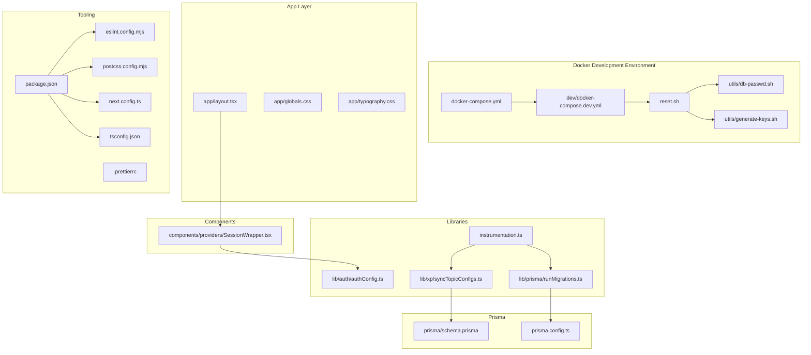
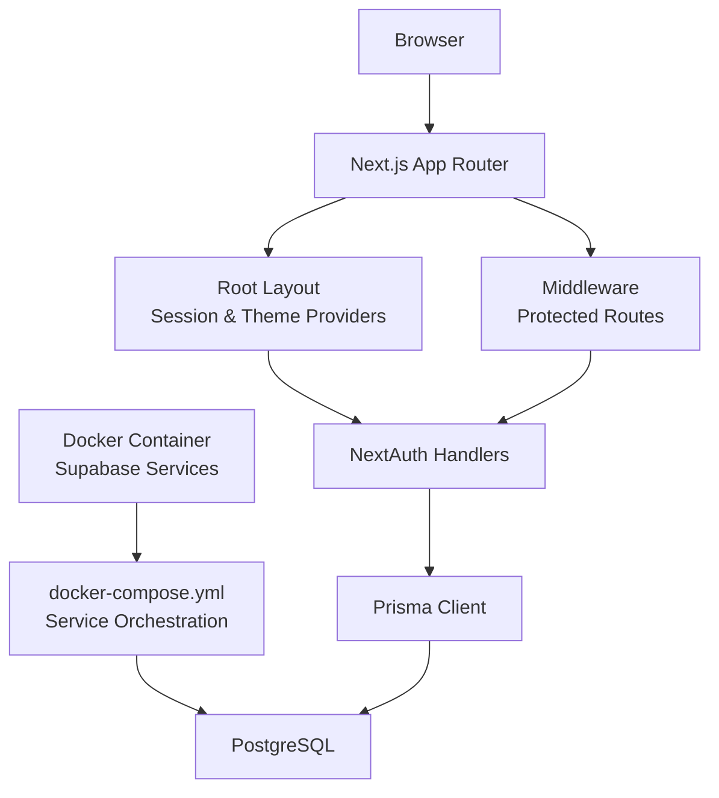
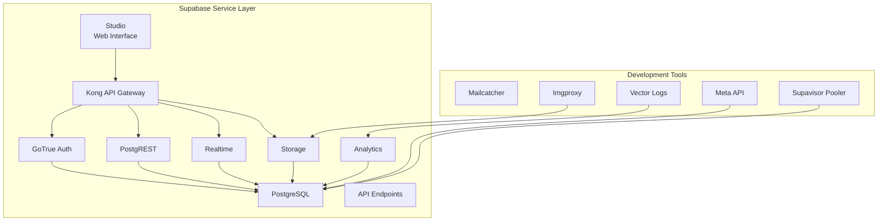
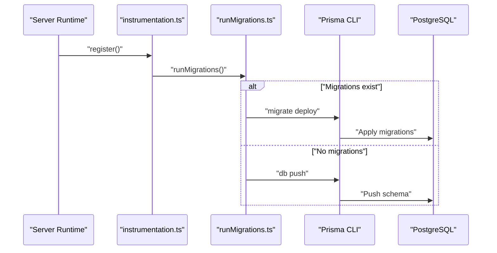
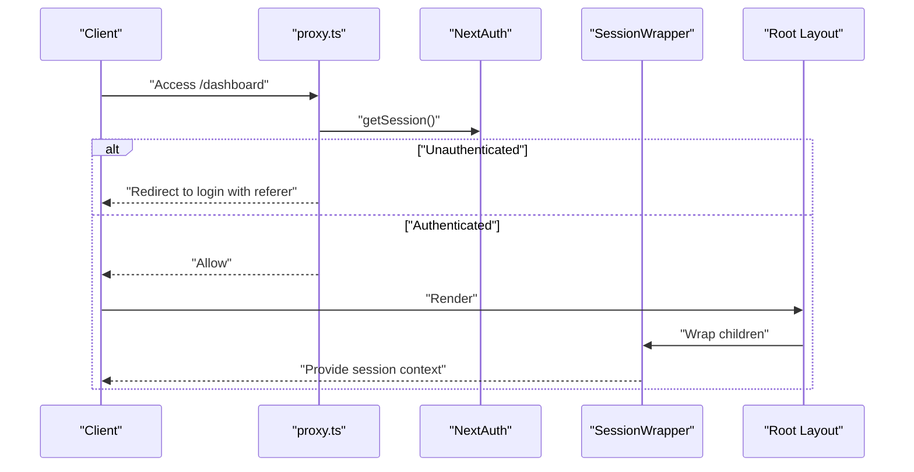
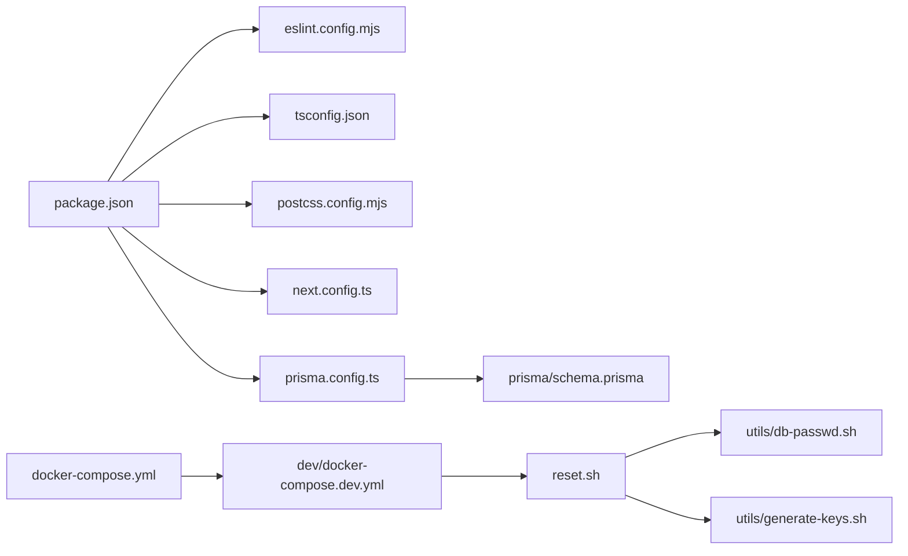

# Development Guide

<cite>
**Referenced Files in This Document**
- [package.json](file://package.json)
- [tsconfig.json](file://tsconfig.json)
- [eslint.config.mjs](file://eslint.config.mjs)
- [postcss.config.mjs](file://postcss.config.mjs)
- [next.config.ts](file://next.config.ts)
- [prisma/schema.prisma](file://prisma/schema.prisma)
- [prisma.config.ts](file://prisma.config.ts)
- [lib/prisma/runMigrations.ts](file://lib/prisma/runMigrations.ts)
- [lib/xp/syncTopicConfigs.ts](file://lib/xp/syncTopicConfigs.ts)
- [instrumentation.ts](file://instrumentation.ts)
- [lib/auth/authConfig.ts](file://lib/auth/authConfig.ts)
- [app/layout.tsx](file://app/layout.tsx)
- [app/globals.css](file://app/globals.css)
- [app/typography.css](file://app/typography.css)
- [components/providers/SessionWrapper.tsx](file://components/providers/SessionWrapper.tsx)
- [.prettierrc](file://.prettierrc)
- [proxy.ts](file://proxy.ts)
- [database/supabase-project/docker-compose.yml](file://database/supabase-project/docker-compose.yml)
- [database/supabase-project/dev/docker-compose.dev.yml](file://database/supabase-project/dev/docker-compose.dev.yml)
- [database/supabase-project/reset.sh](file://database/supabase-project/reset.sh)
- [database/supabase-project/utils/db-passwd.sh](file://database/supabase-project/utils/db-passwd.sh)
- [database/supabase-project/utils/generate-keys.sh](file://database/supabase-project/utils/generate-keys.sh)
- [database/supabase-project/dev/data.sql](file://database/supabase-project/dev/data.sql)
- [database/supabase-project/volumes/db/jwt.sql](file://database/supabase-project/volumes/db/jwt.sql)
- [database/supabase-project/volumes/db/roles.sql](file://database/supabase-project/volumes/db/roles.sql)
- [database/supabase-project/snippet-launch-supabase-docker.md](file://database/supabase-project/snippet-launch-supabase-docker.md)
- [database/supabase-project/versions.md](file://database/supabase-project/versions.md)
</cite>

## Update Summary
**Changes Made**
- Added comprehensive Docker-based development workflow documentation
- Documented Supabase container orchestration and service dependencies
- Added helper scripts for password generation and API key creation
- Included reset functionality and environment management procedures
- Updated development environment configuration with Docker Compose setup
- Added detailed database initialization and security configuration

## Table of Contents
1. [Introduction](#introduction)
2. [Project Structure](#project-structure)
3. [Core Components](#core-components)
4. [Architecture Overview](#architecture-overview)
5. [Docker-Based Development Environment](#docker-based-development-environment)
6. [Supabase Container Orchestration](#supabase-container-orchestration)
7. [Helper Scripts and Utilities](#helper-scripts-and-utilities)
8. [Development Best Practices](#development-best-practices)
9. [Detailed Component Analysis](#detailed-component-analysis)
10. [Dependency Analysis](#dependency-analysis)
11. [Performance Considerations](#performance-considerations)
12. [Troubleshooting Guide](#troubleshooting-guide)
13. [Conclusion](#conclusion)
14. [Appendices](#appendices)

## Introduction
This development guide provides a comprehensive overview of the local development setup, build configuration, code quality standards, and deployment preparation for the project. It documents the TypeScript configuration, ESLint rules, PostCSS/Tailwind setup, Prisma development workflow, and npm script usage. The guide now includes extensive coverage of the new Docker-based development workflow with comprehensive Supabase setup, helper scripts for password generation and API key creation, reset functionality, and detailed development environment configuration.

## Project Structure
The project follows a Next.js app directory structure with app/, components/, lib/, prisma/, content/, and types/ organized by feature and responsibility. The development environment now includes a comprehensive Docker-based setup with Supabase services orchestrated through docker-compose.yml and development-specific configurations in dev/docker-compose.dev.yml.

**Diagram sources**
- [database/supabase-project/docker-compose.yml](file://database/supabase-project/docker-compose.yml#L1-L538)
- [database/supabase-project/dev/docker-compose.dev.yml](file://database/supabase-project/dev/docker-compose.dev.yml#L1-L45)
- [database/supabase-project/reset.sh](file://database/supabase-project/reset.sh#L1-L77)
- [database/supabase-project/utils/db-passwd.sh](file://database/supabase-project/utils/db-passwd.sh#L1-L158)
- [database/supabase-project/utils/generate-keys.sh](file://database/supabase-project/utils/generate-keys.sh#L1-L120)
- [app/layout.tsx](file://app/layout.tsx#L1-L46)
- [components/providers/SessionWrapper.tsx](file://components/providers/SessionWrapper.tsx#L1-L11)
- [lib/auth/authConfig.ts](file://lib/auth/authConfig.ts#L1-L83)
- [instrumentation.ts](file://instrumentation.ts#L1-L44)
- [lib/prisma/runMigrations.ts](file://lib/prisma/runMigrations.ts#L1-L69)
- [lib/xp/syncTopicConfigs.ts](file://lib/xp/syncTopicConfigs.ts#L1-L174)
- [prisma/schema.prisma](file://prisma/schema.prisma#L1-L143)
- [prisma.config.ts](file://prisma.config.ts#L1-L19)
- [package.json](file://package.json#L1-L63)
- [tsconfig.json](file://tsconfig.json#L1-L35)
- [eslint.config.mjs](file://eslint.config.mjs#L1-L24)
- [postcss.config.mjs](file://postcss.config.mjs#L1-L8)
- [next.config.ts](file://next.config.ts#L1-L10)
- [.prettierrc](file://.prettierrc)

**Section sources**
- [database/supabase-project/docker-compose.yml](file://database/supabase-project/docker-compose.yml#L1-L538)
- [database/supabase-project/dev/docker-compose.dev.yml](file://database/supabase-project/dev/docker-compose.dev.yml#L1-L45)
- [database/supabase-project/reset.sh](file://database/supabase-project/reset.sh#L1-L77)
- [database/supabase-project/utils/db-passwd.sh](file://database/supabase-project/utils/db-passwd.sh#L1-L158)
- [database/supabase-project/utils/generate-keys.sh](file://database/supabase-project/utils/generate-keys.sh#L1-L120)

## Core Components
- **Docker Development Environment**: Comprehensive container orchestration with Supabase services including Studio, Kong API gateway, GoTrue auth, PostgREST, Realtime, Storage, and Analytics.
- **TypeScript Configuration**: Strict compilation, ESNext modules, bundler resolution, isolated modules, and JSX transform configured via tsconfig.json.
- **ESLint Configuration**: Extends Next.js core-web-vitals and TypeScript configs, overrides defaults, and disables explicit any rule.
- **PostCSS/Tailwind**: Tailwind PostCSS plugin enabled; CSS imports and theme tokens defined in app/globals.css and app/typography.css.
- **Next.js Configuration**: Remote image pattern for Google avatar images configured.
- **Prisma Configuration**: Dynamic datasource URL from environment variables, migrations path, and schema location.
- **Instrumentation Hooks**: Startup migration runner and topic config sync executed once per server instance.

**Section sources**
- [database/supabase-project/docker-compose.yml](file://database/supabase-project/docker-compose.yml#L1-L538)
- [tsconfig.json](file://tsconfig.json#L1-L35)
- [eslint.config.mjs](file://eslint.config.mjs#L1-L24)
- [postcss.config.mjs](file://postcss.config.mjs#L1-L8)
- [next.config.ts](file://next.config.ts#L1-L10)
- [prisma.config.ts](file://prisma.config.ts#L1-L19)
- [instrumentation.ts](file://instrumentation.ts#L1-L44)

## Architecture Overview
The development stack integrates Next.js app routing, React components, NextAuth for authentication, Prisma for data modeling and migrations, and Tailwind CSS for styling. The new Docker-based architecture provides a complete Supabase development environment with containerized services, while the runtime initialization ensures database migrations and topic synchronization occur on server startup, while middleware enforces protected routes.

**Diagram sources**
- [app/layout.tsx](file://app/layout.tsx#L1-L46)
- [components/providers/SessionWrapper.tsx](file://components/providers/SessionWrapper.tsx#L1-L11)
- [lib/auth/authConfig.ts](file://lib/auth/authConfig.ts#L1-L83)
- [proxy.ts](file://proxy.ts#L1-L25)
- [lib/prisma/runMigrations.ts](file://lib/prisma/runMigrations.ts#L1-L69)
- [prisma/schema.prisma](file://prisma/schema.prisma#L1-L143)
- [database/supabase-project/docker-compose.yml](file://database/supabase-project/docker-compose.yml#L1-L538)

## Docker-Based Development Environment

### Container Orchestration Overview
The project now includes a comprehensive Docker-based development environment managed through docker-compose.yml. This setup provides a complete Supabase development stack with all necessary services running in isolated containers.

### Service Dependencies and Health Checks
The Docker composition defines 15+ interconnected services with health checks and proper dependency chains:
- **Studio**: Web-based database management interface
- **Kong**: API gateway and reverse proxy
- **GoTrue**: Authentication service
- **PostgREST**: RESTful API for PostgreSQL
- **Realtime**: Real-time messaging service
- **Storage**: Object storage service
- **Analytics**: Logflare analytics backend
- **Database**: PostgreSQL with custom configurations
- **Edge Functions**: Serverless function execution
- **Mail Server**: Development email testing

### Development-Specific Configuration
The dev/docker-compose.dev.yml extends the base configuration with:
- Live reload capabilities for Studio development
- Mailcatcher service for email testing
- Development database with seed data
- Port mappings for local development access

**Section sources**
- [database/supabase-project/docker-compose.yml](file://database/supabase-project/docker-compose.yml#L1-L538)
- [database/supabase-project/dev/docker-compose.dev.yml](file://database/supabase-project/dev/docker-compose.dev.yml#L1-L45)

## Supabase Container Orchestration

### Service Architecture
The Supabase ecosystem consists of tightly integrated microservices that work together to provide a complete backend-as-a-service platform:

**Diagram sources**
- [database/supabase-project/docker-compose.yml](file://database/supabase-project/docker-compose.yml#L12-L538)

### Database Initialization and Security
The database setup includes comprehensive security configurations:
- Custom JWT settings applied during initialization
- Role-based access control with specific passwords
- Realtime publication setup for streaming data
- Storage bucket configuration for avatar management

**Section sources**
- [database/supabase-project/volumes/db/jwt.sql](file://database/supabase-project/volumes/db/jwt.sql#L1-L6)
- [database/supabase-project/volumes/db/roles.sql](file://database/supabase-project/volumes/db/roles.sql#L1-L9)
- [database/supabase-project/dev/data.sql](file://database/supabase-project/dev/data.sql#L1-L49)

## Helper Scripts and Utilities

### Password Generation Script
The db-passwd.sh script provides automated password management for Supabase database users:
- Generates secure random passwords using OpenSSL
- Updates multiple database roles simultaneously
- Handles analytics backend connection string updates
- Includes interactive confirmation prompts

### API Key Generation Script
The generate-keys.sh script creates comprehensive authentication credentials:
- JWT secrets with cryptographic strength
- Anonymous and service role keys
- Dashboard and analytics tokens
- Database and administrative credentials

### Reset Functionality
The reset.sh script provides complete environment cleanup:
- Stops and removes all containers and volumes
- Cleans bind-mounted directories
- Resets .env file to default configuration
- Includes safety confirmations for destructive operations

**Section sources**
- [database/supabase-project/utils/db-passwd.sh](file://database/supabase-project/utils/db-passwd.sh#L1-L158)
- [database/supabase-project/utils/generate-keys.sh](file://database/supabase-project/utils/generate-keys.sh#L1-L120)
- [database/supabase-project/reset.sh](file://database/supabase-project/reset.sh#L1-L77)

## Development Best Practices

### Docker Development Workflow
- Use docker compose up for initial setup and development
- Leverage dev/docker-compose.dev.yml for enhanced development experience
- Utilize helper scripts for environment management
- Follow proper container lifecycle management

### Environment Management
- Maintain separate .env files for different environments
- Use generate-keys.sh for initial credential setup
- Regularly update passwords with db-passwd.sh
- Monitor container health and logs

### Database Development
- Use development database with seed data for local testing
- Implement proper role-based access control
- Test Realtime functionality with proper publication setup
- Validate Storage bucket configurations

## Detailed Component Analysis

### TypeScript Configuration
- Compiler options emphasize strictness, modern JS features, and Next.js-specific plugins.
- Path aliases simplify imports using @/.
- Incremental builds and isolated modules improve DX and performance.

**Section sources**
- [tsconfig.json](file://tsconfig.json#L1-L35)

### ESLint Configuration
- Uses Next.js recommended configs for core web vitals and TypeScript.
- Overrides default ignores to include generated types and app sources.
- Disables explicit any rule to balance safety and developer velocity.

**Section sources**
- [eslint.config.mjs](file://eslint.config.mjs#L1-L24)

### PostCSS and Tailwind Setup
- Tailwind PostCSS plugin is enabled via postcss.config.mjs.
- Global CSS imports Tailwind directives and typography styles.
- Dark mode variant and theme tokens are defined in app/globals.css.

**Section sources**
- [postcss.config.mjs](file://postcss.config.mjs#L1-L8)
- [app/globals.css](file://app/globals.css#L1-L14)
- [app/typography.css](file://app/typography.css#L1-L11)

### Next.js Configuration
- Remote image patterns allow Google avatar images for authenticated users.
- Ensures safe external image loading for auth-related avatars.

**Section sources**
- [next.config.ts](file://next.config.ts#L1-L10)

### Prisma Development Workflow
- Schema defines enums, models, relations, and indexes for users, accounts, verification tokens, topic XP configurations, user-topic XP, and user task attempts.
- Prisma config constructs DATABASE_URL from environment variables and sets schema and migrations paths.
- Migration runner dynamically executes either migrate deploy (production) or db push (development) with graceful fallbacks and warnings.
- Topic config sync reads content configs and upserts into the database, logging successes and failures.

**Diagram sources**
- [instrumentation.ts](file://instrumentation.ts#L1-L44)
- [lib/prisma/runMigrations.ts](file://lib/prisma/runMigrations.ts#L1-L69)
- [prisma.config.ts](file://prisma.config.ts#L1-L19)

**Section sources**
- [prisma/schema.prisma](file://prisma/schema.prisma#L1-L143)
- [prisma.config.ts](file://prisma.config.ts#L1-L19)
- [lib/prisma/runMigrations.ts](file://lib/prisma/runMigrations.ts#L1-L69)
- [lib/xp/syncTopicConfigs.ts](file://lib/xp/syncTopicConfigs.ts#L1-L174)

### Authentication and Session Management
- NextAuth configuration integrates Prisma adapter, JWT sessions, and multiple providers (Google, GitHub, Resend, Facebook).
- Session wrapper provides client-side session context with configurable refetch behavior.
- Middleware protects dashboard routes and redirects unauthenticated users to the login page.

**Diagram sources**
- [proxy.ts](file://proxy.ts#L1-L25)
- [lib/auth/authConfig.ts](file://lib/auth/authConfig.ts#L1-L83)
- [components/providers/SessionWrapper.tsx](file://components/providers/SessionWrapper.tsx#L1-L11)
- [app/layout.tsx](file://app/layout.tsx#L1-L46)

**Section sources**
- [lib/auth/authConfig.ts](file://lib/auth/authConfig.ts#L1-L83)
- [components/providers/SessionWrapper.tsx](file://components/providers/SessionWrapper.tsx#L1-L11)
- [proxy.ts](file://proxy.ts#L1-L25)

### Content and Topic Configuration Sync
- Topic configs are loaded from content/math/*/config.json and upserted into the database.
- Supports incremental updates and optional fields with null handling.
- Provides helpers to load individual or all topic configs.

**Section sources**
- [lib/xp/syncTopicConfigs.ts](file://lib/xp/syncTopicConfigs.ts#L1-L174)

## Dependency Analysis
The project's development dependencies include TypeScript, ESLint, Prettier, Tailwind CSS, and Sass. The Docker environment adds comprehensive container orchestration dependencies. Scripts orchestrate development, building, linting, Prisma operations, and Docker container management. Runtime dependencies include Next.js, NextAuth, Prisma client, and Firebase.

**Diagram sources**
- [package.json](file://package.json#L1-L63)
- [eslint.config.mjs](file://eslint.config.mjs#L1-L24)
- [tsconfig.json](file://tsconfig.json#L1-L35)
- [postcss.config.mjs](file://postcss.config.mjs#L1-L8)
- [next.config.ts](file://next.config.ts#L1-L10)
- [prisma.config.ts](file://prisma.config.ts#L1-L19)
- [prisma/schema.prisma](file://prisma/schema.prisma#L1-L143)
- [database/supabase-project/docker-compose.yml](file://database/supabase-project/docker-compose.yml#L1-L538)
- [database/supabase-project/dev/docker-compose.dev.yml](file://database/supabase-project/dev/docker-compose.dev.yml#L1-L45)
- [database/supabase-project/reset.sh](file://database/supabase-project/reset.sh#L1-L77)
- [database/supabase-project/utils/db-passwd.sh](file://database/supabase-project/utils/db-passwd.sh#L1-L158)
- [database/supabase-project/utils/generate-keys.sh](file://database/supabase-project/utils/generate-keys.sh#L1-L120)

**Section sources**
- [package.json](file://package.json#L1-L63)

## Performance Considerations
- Use incremental TypeScript builds and isolated modules to speed up type checking during development.
- Prefer migrate deploy over db push in production for deterministic schema evolution.
- Keep middleware minimal and cacheable where appropriate to reduce overhead.
- Leverage Next.js static generation and ISR for content-heavy pages.
- Optimize image loading with Next.js Image component and configured remote patterns.
- **Updated**: Docker containers should be optimized for development with proper resource limits and health checks.
- **Updated**: Use development compose files for hot reloading and live updates during development.

## Troubleshooting Guide
- Prisma migrations fail silently in Edge runtime: The instrumentation guard prevents migration execution in edge runtime and logs warnings.
- Database unreachable during startup: Both instrumentation and migration runner handle database errors gracefully and log warnings.
- Topic sync fails: Errors are caught and logged; check content/config.json validity and database connectivity.
- Authentication redirect loops: Verify middleware matcher and session provider configuration.
- **Updated**: Docker container startup failures: Check health checks and service dependencies in docker-compose.yml.
- **Updated**: Database connection issues: Verify POSTGRES_PASSWORD and connection string configurations.
- **Updated**: Service port conflicts: Review port mappings in docker-compose.dev.yml and adjust as needed.
- **Updated**: Environment variable issues: Use generate-keys.sh to regenerate credentials and verify .env file integrity.

**Section sources**
- [instrumentation.ts](file://instrumentation.ts#L1-L44)
- [lib/prisma/runMigrations.ts](file://lib/prisma/runMigrations.ts#L1-L69)
- [lib/xp/syncTopicConfigs.ts](file://lib/xp/syncTopicConfigs.ts#L1-L174)
- [proxy.ts](file://proxy.ts#L1-L25)
- [database/supabase-project/docker-compose.yml](file://database/supabase-project/docker-compose.yml#L1-L538)
- [database/supabase-project/utils/generate-keys.sh](file://database/supabase-project/utils/generate-keys.sh#L1-L120)

## Conclusion
This guide consolidates local development setup, configuration, and operational workflows for the project, now including comprehensive Docker-based development with Supabase services. By following the documented practices—TypeScript strictness, ESLint rules, PostCSS/Tailwind integration, Prisma migrations, NextAuth integration, and Docker container orchestration—you can maintain a robust, scalable, and contributor-friendly development environment with full backend-as-a-service functionality.

## Appendices

### Local Development Setup
- Install dependencies and run the development server using the scripts defined in package.json.
- Configure environment variables for authentication providers and database connection as required by prisma.config.ts and lib/auth/authConfig.ts.
- **Updated**: For Docker-based development, ensure Docker Desktop is installed and run `docker compose up -d` from the database/supabase-project directory.
- **Updated**: Use helper scripts for initial setup: `./utils/generate-keys.sh` for credentials and `./reset.sh` for environment cleanup.

**Section sources**
- [package.json](file://package.json#L1-L63)
- [prisma.config.ts](file://prisma.config.ts#L1-L19)
- [lib/auth/authConfig.ts](file://lib/auth/authConfig.ts#L1-L83)
- [database/supabase-project/utils/generate-keys.sh](file://database/supabase-project/utils/generate-keys.sh#L1-L120)
- [database/supabase-project/reset.sh](file://database/supabase-project/reset.sh#L1-L77)

### Docker Development Environment
- **New Section**: Navigate to database/supabase-project and run `docker compose up -d` to start all Supabase services.
- **New Section**: Use `docker compose -f docker-compose.yml -f ./dev/docker-compose.dev.yml up` for development with hot reload.
- **New Section**: Access Supabase Studio at http://localhost:8082 and Kong API gateway at http://localhost:8000.
- **New Section**: Monitor container health with `docker compose ps` and view logs with `docker compose logs -f`.

**Section sources**
- [database/supabase-project/docker-compose.yml](file://database/supabase-project/docker-compose.yml#L1-L538)
- [database/supabase-project/dev/docker-compose.dev.yml](file://database/supabase-project/dev/docker-compose.dev.yml#L1-L45)
- [database/supabase-project/snippet-launch-supabase-docker.md](file://database/supabase-project/snippet-launch-supabase-docker.md#L1-L3)

### Build and Deployment Preparation
- Use the build script to compile the Next.js application.
- Ensure Prisma migrations are applied in production using migrate deploy or db push depending on environment.
- Validate linting and formatting with ESLint and Prettier before committing.
- **Updated**: For Docker deployments, use the production docker-compose.yml without development overrides.

**Section sources**
- [package.json](file://package.json#L1-L63)
- [lib/prisma/runMigrations.ts](file://lib/prisma/runMigrations.ts#L1-L69)
- [eslint.config.mjs](file://eslint.config.mjs#L1-L24)
- [.prettierrc](file://.prettierrc)
- [database/supabase-project/docker-compose.yml](file://database/supabase-project/docker-compose.yml#L1-L538)

### Code Quality Standards
- Enforce strict TypeScript compilation and disable explicit any to improve type safety.
- Use ESLint Next.js recommended configs and override ignores as needed.
- Apply Prettier with Tailwind plugin for consistent formatting.
- **Updated**: Include Docker Compose files in linting configuration for infrastructure code.

**Section sources**
- [tsconfig.json](file://tsconfig.json#L1-L35)
- [eslint.config.mjs](file://eslint.config.mjs#L1-L24)
- [.prettierrc](file://.prettierrc)

### Testing Strategies
- Unit test components and utilities under components/, lib/, and types/.
- Integration tests can validate middleware behavior and authentication flows.
- Snapshot testing for styled components leveraging Tailwind variants.
- **Updated**: Test Docker environment setup with container health checks and service availability.
- **Updated**: Validate database initialization scripts and role configurations.

### Debugging Techniques
- Use console logging in instrumentation and migration runner to trace startup issues.
- Enable verbose logging for Prisma client and NextAuth to inspect requests and responses.
- Inspect browser network tab for authentication redirects and middleware rewrites.
- **Updated**: Use Docker logs with `docker compose logs -f` to debug container issues.
- **Updated**: Monitor service health with `docker compose ps` and individual service logs.
- **Updated**: Validate environment variables with `docker compose exec db env` for database container.

### Environment Management
- **New Section**: Use generate-keys.sh to create initial authentication credentials.
- **New Section**: Run reset.sh with `-y` flag for automated environment cleanup.
- **New Section**: Update passwords regularly using db-passwd.sh for security compliance.
- **New Section**: Monitor image versions with versions.md for upgrade planning.

**Section sources**
- [database/supabase-project/utils/generate-keys.sh](file://database/supabase-project/utils/generate-keys.sh#L1-L120)
- [database/supabase-project/reset.sh](file://database/supabase-project/reset.sh#L1-L77)
- [database/supabase-project/utils/db-passwd.sh](file://database/supabase-project/utils/db-passwd.sh#L1-L158)
- [database/supabase-project/versions.md](file://database/supabase-project/versions.md#L1-L84)