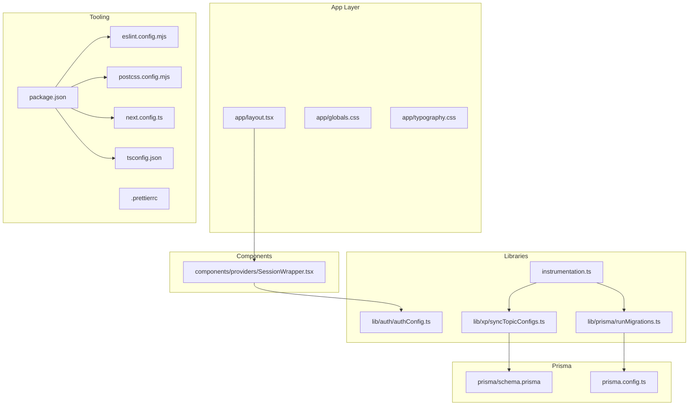
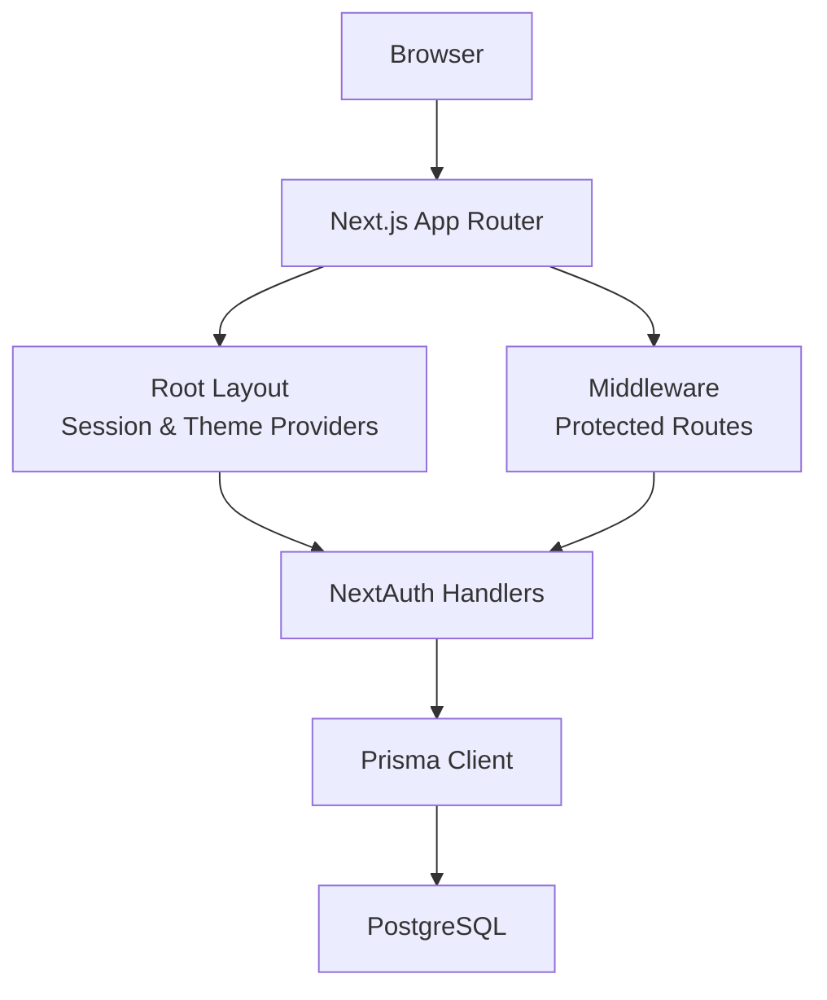
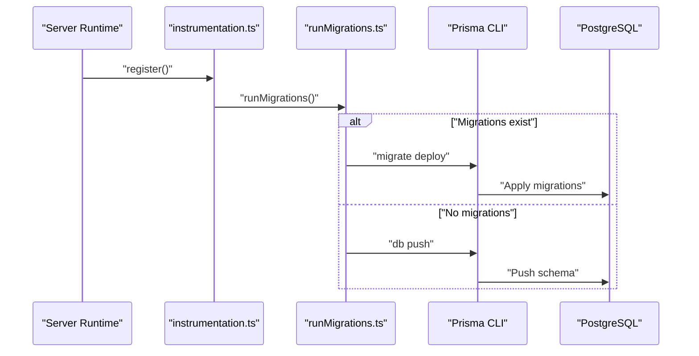
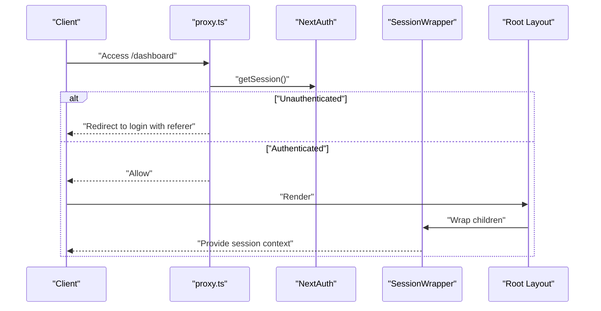
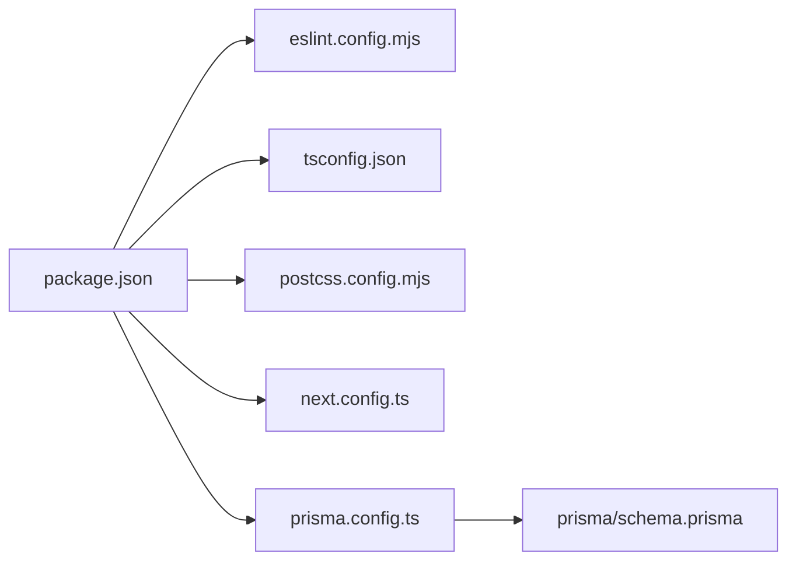

# Development Guide

<cite>
**Referenced Files in This Document**
- [package.json](file://package.json)
- [tsconfig.json](file://tsconfig.json)
- [eslint.config.mjs](file://eslint.config.mjs)
- [postcss.config.mjs](file://postcss.config.mjs)
- [next.config.ts](file://next.config.ts)
- [prisma/schema.prisma](file://prisma/schema.prisma)
- [prisma.config.ts](file://prisma.config.ts)
- [lib/prisma/runMigrations.ts](file://lib/prisma/runMigrations.ts)
- [lib/xp/syncTopicConfigs.ts](file://lib/xp/syncTopicConfigs.ts)
- [instrumentation.ts](file://instrumentation.ts)
- [lib/auth/authConfig.ts](file://lib/auth/authConfig.ts)
- [app/layout.tsx](file://app/layout.tsx)
- [app/globals.css](file://app/globals.css)
- [app/typography.css](file://app/typography.css)
- [components/providers/SessionWrapper.tsx](file://components/providers/SessionWrapper.tsx)
- [.prettierrc](file://.prettierrc)
- [proxy.ts](file://proxy.ts)
</cite>

## Table of Contents
1. [Introduction](#introduction)
2. [Project Structure](#project-structure)
3. [Core Components](#core-components)
4. [Architecture Overview](#architecture-overview)
5. [Detailed Component Analysis](#detailed-component-analysis)
6. [Dependency Analysis](#dependency-analysis)
7. [Performance Considerations](#performance-considerations)
8. [Troubleshooting Guide](#troubleshooting-guide)
9. [Conclusion](#conclusion)
10. [Appendices](#appendices)

## Introduction
This development guide provides a comprehensive overview of the local development setup, build configuration, code quality standards, and deployment preparation for the project. It documents the TypeScript configuration, ESLint rules, PostCSS/Tailwind setup, Prisma development workflow, and npm script usage. It also outlines development best practices, debugging techniques, testing strategies, and performance optimization approaches tailored to this codebase.

## Project Structure
The project follows a Next.js app directory structure with app/, components/, lib/, prisma/, content/, and types/ organized by feature and responsibility. Key configuration files include package.json for scripts and dependencies, tsconfig.json for TypeScript compilation, eslint.config.mjs for linting, postcss.config.mjs for CSS processing, next.config.ts for Next.js configuration, and prisma.config.ts for Prisma configuration.

**Diagram sources**
- [app/layout.tsx](file://app/layout.tsx#L1-L46)
- [components/providers/SessionWrapper.tsx](file://components/providers/SessionWrapper.tsx#L1-L11)
- [lib/auth/authConfig.ts](file://lib/auth/authConfig.ts#L1-L83)
- [instrumentation.ts](file://instrumentation.ts#L1-L44)
- [lib/prisma/runMigrations.ts](file://lib/prisma/runMigrations.ts#L1-L69)
- [lib/xp/syncTopicConfigs.ts](file://lib/xp/syncTopicConfigs.ts#L1-L174)
- [prisma/schema.prisma](file://prisma/schema.prisma#L1-L143)
- [prisma.config.ts](file://prisma.config.ts#L1-L19)
- [package.json](file://package.json#L1-L63)
- [tsconfig.json](file://tsconfig.json#L1-L35)
- [eslint.config.mjs](file://eslint.config.mjs#L1-L24)
- [postcss.config.mjs](file://postcss.config.mjs#L1-L8)
- [next.config.ts](file://next.config.ts#L1-L10)
- [.prettierrc](file://.prettierrc)

**Section sources**
- [package.json](file://package.json#L1-L63)
- [tsconfig.json](file://tsconfig.json#L1-L35)
- [eslint.config.mjs](file://eslint.config.mjs#L1-L24)
- [postcss.config.mjs](file://postcss.config.mjs#L1-L8)
- [next.config.ts](file://next.config.ts#L1-L10)
- [prisma/schema.prisma](file://prisma/schema.prisma#L1-L143)
- [prisma.config.ts](file://prisma.config.ts#L1-L19)

## Core Components
- TypeScript configuration: Strict compilation, ESNext modules, bundler resolution, isolated modules, and JSX transform configured via tsconfig.json.
- ESLint configuration: Extends Next.js core-web-vitals and TypeScript configs, overrides defaults, and disables explicit any rule.
- PostCSS/Tailwind: Tailwind PostCSS plugin enabled; CSS imports and theme tokens defined in app/globals.css and app/typography.css.
- Next.js configuration: Remote image pattern for Google avatar images configured.
- Prisma configuration: Dynamic datasource URL from environment variables, migrations path, and schema location.
- Instrumentation hooks: Startup migration runner and topic config sync executed once per server instance.

**Section sources**
- [tsconfig.json](file://tsconfig.json#L1-L35)
- [eslint.config.mjs](file://eslint.config.mjs#L1-L24)
- [postcss.config.mjs](file://postcss.config.mjs#L1-L8)
- [next.config.ts](file://next.config.ts#L1-L10)
- [prisma.config.ts](file://prisma.config.ts#L1-L19)
- [instrumentation.ts](file://instrumentation.ts#L1-L44)

## Architecture Overview
The development stack integrates Next.js app routing, React components, NextAuth for authentication, Prisma for data modeling and migrations, and Tailwind CSS for styling. The runtime initialization ensures database migrations and topic synchronization occur on server startup, while middleware enforces protected routes.

**Diagram sources**
- [app/layout.tsx](file://app/layout.tsx#L1-L46)
- [components/providers/SessionWrapper.tsx](file://components/providers/SessionWrapper.tsx#L1-L11)
- [lib/auth/authConfig.ts](file://lib/auth/authConfig.ts#L1-L83)
- [proxy.ts](file://proxy.ts#L1-L25)
- [lib/prisma/runMigrations.ts](file://lib/prisma/runMigrations.ts#L1-L69)
- [prisma/schema.prisma](file://prisma/schema.prisma#L1-L143)

## Detailed Component Analysis

### TypeScript Configuration
- Compiler options emphasize strictness, modern JS features, and Next.js-specific plugins.
- Path aliases simplify imports using @/.
- Incremental builds and isolated modules improve DX and performance.

**Section sources**
- [tsconfig.json](file://tsconfig.json#L1-L35)

### ESLint Configuration
- Uses Next.js recommended configs for core web vitals and TypeScript.
- Overrides default ignores to include generated types and app sources.
- Disables explicit any rule to balance safety and developer velocity.

**Section sources**
- [eslint.config.mjs](file://eslint.config.mjs#L1-L24)

### PostCSS and Tailwind Setup
- Tailwind PostCSS plugin is enabled via postcss.config.mjs.
- Global CSS imports Tailwind directives and typography styles.
- Dark mode variant and theme tokens are defined in app/globals.css.

**Section sources**
- [postcss.config.mjs](file://postcss.config.mjs#L1-L8)
- [app/globals.css](file://app/globals.css#L1-L14)
- [app/typography.css](file://app/typography.css#L1-L11)

### Next.js Configuration
- Remote image patterns allow Google avatar images for authenticated users.
- Ensures safe external image loading for auth-related avatars.

**Section sources**
- [next.config.ts](file://next.config.ts#L1-L10)

### Prisma Development Workflow
- Schema defines enums, models, relations, and indexes for users, accounts, verification tokens, topic XP configurations, user-topic XP, and user task attempts.
- Prisma config constructs DATABASE_URL from environment variables and sets schema and migrations paths.
- Migration runner dynamically executes either migrate deploy (production) or db push (development) with graceful fallbacks and warnings.
- Topic config sync reads content configs and upserts into the database, logging successes and failures.

**Diagram sources**
- [instrumentation.ts](file://instrumentation.ts#L1-L44)
- [lib/prisma/runMigrations.ts](file://lib/prisma/runMigrations.ts#L1-L69)
- [prisma.config.ts](file://prisma.config.ts#L1-L19)

**Section sources**
- [prisma/schema.prisma](file://prisma/schema.prisma#L1-L143)
- [prisma.config.ts](file://prisma.config.ts#L1-L19)
- [lib/prisma/runMigrations.ts](file://lib/prisma/runMigrations.ts#L1-L69)
- [lib/xp/syncTopicConfigs.ts](file://lib/xp/syncTopicConfigs.ts#L1-L174)

### Authentication and Session Management
- NextAuth configuration integrates Prisma adapter, JWT sessions, and multiple providers (Google, GitHub, Resend, Facebook).
- Session wrapper provides client-side session context with configurable refetch behavior.
- Middleware protects dashboard routes and redirects unauthenticated users to the login page.

**Diagram sources**
- [proxy.ts](file://proxy.ts#L1-L25)
- [lib/auth/authConfig.ts](file://lib/auth/authConfig.ts#L1-L83)
- [components/providers/SessionWrapper.tsx](file://components/providers/SessionWrapper.tsx#L1-L11)
- [app/layout.tsx](file://app/layout.tsx#L1-L46)

**Section sources**
- [lib/auth/authConfig.ts](file://lib/auth/authConfig.ts#L1-L83)
- [components/providers/SessionWrapper.tsx](file://components/providers/SessionWrapper.tsx#L1-L11)
- [proxy.ts](file://proxy.ts#L1-L25)

### Content and Topic Configuration Sync
- Topic configs are loaded from content/math/*/config.json and upserted into the database.
- Supports incremental updates and optional fields with null handling.
- Provides helpers to load individual or all topic configs.

**Section sources**
- [lib/xp/syncTopicConfigs.ts](file://lib/xp/syncTopicConfigs.ts#L1-L174)

## Dependency Analysis
The project’s development dependencies include TypeScript, ESLint, Prettier, Tailwind CSS, and Sass. Scripts orchestrate development, building, linting, and Prisma operations. Runtime dependencies include Next.js, NextAuth, Prisma client, and Firebase.

**Diagram sources**
- [package.json](file://package.json#L1-L63)
- [eslint.config.mjs](file://eslint.config.mjs#L1-L24)
- [tsconfig.json](file://tsconfig.json#L1-L35)
- [postcss.config.mjs](file://postcss.config.mjs#L1-L8)
- [next.config.ts](file://next.config.ts#L1-L10)
- [prisma.config.ts](file://prisma.config.ts#L1-L19)
- [prisma/schema.prisma](file://prisma/schema.prisma#L1-L143)

**Section sources**
- [package.json](file://package.json#L1-L63)

## Performance Considerations
- Use incremental TypeScript builds and isolated modules to speed up type checking during development.
- Prefer migrate deploy over db push in production for deterministic schema evolution.
- Keep middleware minimal and cacheable where appropriate to reduce overhead.
- Leverage Next.js static generation and ISR for content-heavy pages.
- Optimize image loading with Next.js Image component and configured remote patterns.

## Troubleshooting Guide
- Prisma migrations fail silently in Edge runtime: The instrumentation guard prevents migration execution in edge runtime and logs warnings.
- Database unreachable during startup: Both instrumentation and migration runner handle database errors gracefully and log warnings.
- Topic sync fails: Errors are caught and logged; check content/config.json validity and database connectivity.
- Authentication redirect loops: Verify middleware matcher and session provider configuration.

**Section sources**
- [instrumentation.ts](file://instrumentation.ts#L1-L44)
- [lib/prisma/runMigrations.ts](file://lib/prisma/runMigrations.ts#L1-L69)
- [lib/xp/syncTopicConfigs.ts](file://lib/xp/syncTopicConfigs.ts#L1-L174)
- [proxy.ts](file://proxy.ts#L1-L25)

## Conclusion
This guide consolidates local development setup, configuration, and operational workflows for the project. By following the documented practices—TypeScript strictness, ESLint rules, PostCSS/Tailwind integration, Prisma migrations, and NextAuth integration—you can maintain a robust, scalable, and contributor-friendly development environment.

## Appendices

### Local Development Setup
- Install dependencies and run the development server using the scripts defined in package.json.
- Configure environment variables for authentication providers and database connection as required by prisma.config.ts and lib/auth/authConfig.ts.

**Section sources**
- [package.json](file://package.json#L1-L63)
- [prisma.config.ts](file://prisma.config.ts#L1-L19)
- [lib/auth/authConfig.ts](file://lib/auth/authConfig.ts#L1-L83)

### Build and Deployment Preparation
- Use the build script to compile the Next.js application.
- Ensure Prisma migrations are applied in production using migrate deploy or db push depending on environment.
- Validate linting and formatting with ESLint and Prettier before committing.

**Section sources**
- [package.json](file://package.json#L1-L63)
- [lib/prisma/runMigrations.ts](file://lib/prisma/runMigrations.ts#L1-L69)
- [eslint.config.mjs](file://eslint.config.mjs#L1-L24)
- [.prettierrc](file://.prettierrc)

### Code Quality Standards
- Enforce strict TypeScript compilation and disable explicit any to improve type safety.
- Use ESLint Next.js recommended configs and override ignores as needed.
- Apply Prettier with Tailwind plugin for consistent formatting.

**Section sources**
- [tsconfig.json](file://tsconfig.json#L1-L35)
- [eslint.config.mjs](file://eslint.config.mjs#L1-L24)
- [.prettierrc](file://.prettierrc)

### Testing Strategies
- Unit test components and utilities under components/, lib/, and types/.
- Integration tests can validate middleware behavior and authentication flows.
- Snapshot testing for styled components leveraging Tailwind variants.

[No sources needed since this section provides general guidance]

### Debugging Techniques
- Use console logging in instrumentation and migration runner to trace startup issues.
- Enable verbose logging for Prisma client and NextAuth to inspect requests and responses.
- Inspect browser network tab for authentication redirects and middleware rewrites.

[No sources needed since this section provides general guidance]