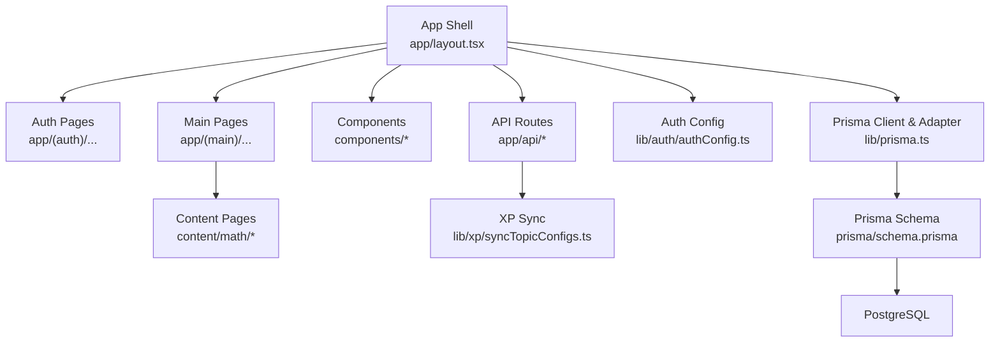
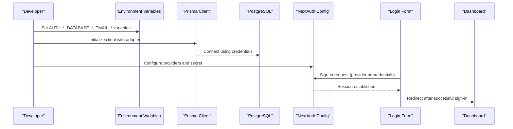
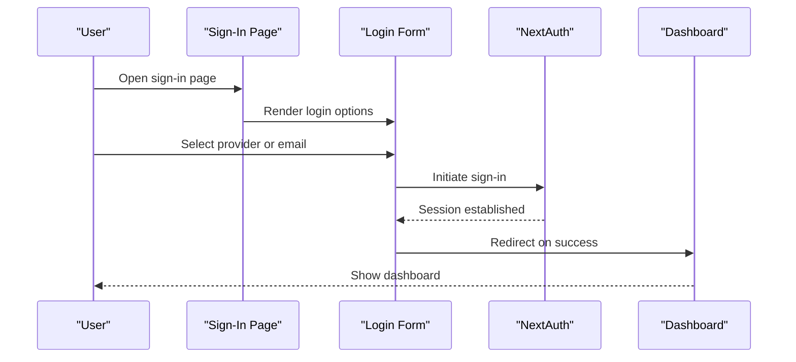
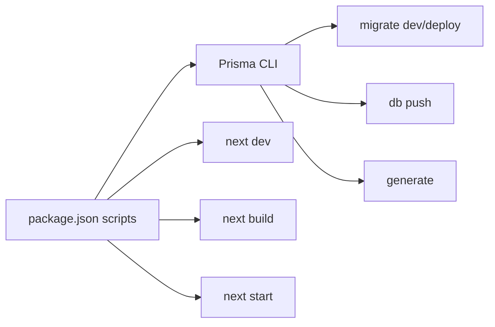

# Getting Started

<cite>
**Referenced Files in This Document**
- [README.md](file://README.md)
- [package.json](file://package.json)
- [prisma\schema.prisma](file://prisma/schema.prisma)
- [prisma.config.ts](file://prisma.config.ts)
- [lib\prisma.ts](file://lib\prisma.ts)
- [lib\prisma\runMigrations.ts](file://lib\prisma\runMigrations.ts)
- [lib\auth\authConfig.ts](file://lib\auth\authConfig.ts)
- [app\layout.tsx](file://app\layout.tsx)
- [components\auth\LoginForm.tsx](file://components\auth\LoginForm.tsx)
- [app\(auth)\auth\sign-in\page.tsx](file://app\(auth)\auth\sign-in\page.tsx)
- [app\(main)\dashboard\dashboard.tsx](file://app\(main)\dashboard\dashboard.tsx)
- [lib\xp\syncTopicConfigs.ts](file://lib\xp\syncTopicConfigs.ts)
- [app\api\sync-topics\route.ts](file://app\api\sync-topics\route.ts)
- [XP_SYSTEM.md](file://XP_SYSTEM.md)
- [content\math\allTopics.json](file://content\math\allTopics.json)
- [content\math\addition_and_subtraction_of_fractions\config.json](file://content\math\addition_and_subtraction_of_fractions\config.json)
- [content\math\natural_numbers\index.mdx](file://content\math\natural_numbers\index.mdx)
</cite>

## Table of Contents
1. [Introduction](#introduction)
2. [Project Structure](#project-structure)
3. [Core Components](#core-components)
4. [Architecture Overview](#architecture-overview)
5. [Detailed Component Analysis](#detailed-component-analysis)
6. [Dependency Analysis](#dependency-analysis)
7. [Performance Considerations](#performance-considerations)
8. [Troubleshooting Guide](#troubleshooting-guide)
9. [Conclusion](#conclusion)
10. [Appendices](#appendices)

## Introduction
This guide helps you install, configure, and run the math learning application locally. It covers prerequisites, environment setup, database configuration, OAuth provider setup, and launching the app. You will also learn how content topics are synchronized into the database and what the first-time user experience looks like.

Educational purpose and audience:
- Purpose: An interactive math learning platform with lessons, exercises, and a spaced repetition system (SRS) to help learners practice and retain knowledge progressively.
- Target audience: Learners studying mathematics at various levels who benefit from structured lessons, adaptive practice, and gamified XP progression.

## Project Structure
The application is a Next.js app with:
- App router pages under app/
- Shared components under components/
- Content-driven lessons under content/
- Authentication via NextAuth.js with Prisma adapter
- Database via Prisma and PostgreSQL
- XP and SRS logic under lib/xp/

**Diagram sources**
- [app\layout.tsx](file://app\layout.tsx#L29-L45)
- [lib\auth\authConfig.ts](file://lib\auth\authConfig.ts#L16-L82)
- [lib\prisma.ts](file://lib\prisma.ts#L20-L26)
- [prisma\schema.prisma](file://prisma\schema.prisma#L8-L10)
- [lib\xp\syncTopicConfigs.ts](file://lib\xp\syncTopicConfigs.ts#L10-L49)

**Section sources**
- [app\layout.tsx](file://app\layout.tsx#L29-L45)
- [lib\prisma.ts](file://lib\prisma.ts#L1-L29)
- [prisma\schema.prisma](file://prisma\schema.prisma#L1-L143)

## Core Components
- Authentication: NextAuth.js configured with multiple providers (Google, GitHub, Facebook) and a credentials provider for Google One Tap. Sessions use JWT strategy.
- Database: Prisma client with a PostgreSQL adapter using environment variables for connection details.
- Content and Topics: Lessons and exercises are driven by content files under content/, with topic configurations upserted into the database.
- XP and SRS: A comprehensive system tracks user progress per topic, anti-grind mechanics, and spaced repetition intervals.

**Section sources**
- [lib\auth\authConfig.ts](file://lib\auth\authConfig.ts#L16-L82)
- [lib\prisma.ts](file://lib\prisma.ts#L1-L29)
- [lib\xp\syncTopicConfigs.ts](file://lib\xp\syncTopicConfigs.ts#L10-L49)
- [XP_SYSTEM.md](file://XP_SYSTEM.md#L1-L356)

## Architecture Overview
High-level flow during startup and user interaction:
- Startup: Environment variables are read to configure Prisma and NextAuth. Optional migrations are applied. Topic configs are synced into the database.
- User login: The login form triggers provider-based sign-in flows. On success, the session is updated and the user is redirected to the dashboard.
- Content consumption: Lessons and exercises are rendered from content files and topic configurations.

**Diagram sources**
- [lib\prisma.ts](file://lib\prisma.ts#L10-L16)
- [lib\auth\authConfig.ts](file://lib\auth\authConfig.ts#L16-L63)
- [components\auth\LoginForm.tsx](file://components\auth\LoginForm.tsx#L18-L50)
- [app\(auth)\auth\sign-in\page.tsx](file://app\(auth)\auth\sign-in\page.tsx#L4-L13)
- [app\(main)\dashboard\dashboard.tsx](file://app\(main)\dashboard\dashboard.tsx#L1-L4)

## Detailed Component Analysis

### Prerequisites and Setup
- Node.js: Required to run the Next.js application and Prisma CLI scripts.
- PostgreSQL: Required by Prisma adapter; credentials are supplied via environment variables.
- Next.js: Application framework; scripts are defined in package.json.

Install dependencies and run:
- Install dependencies using your preferred package manager.
- Start the development server with the dev script.
- Build and start production with build and start scripts.

**Section sources**
- [package.json](file://package.json#L5-L14)

### Environment Variables
Create a .env file with the following categories:
- NextAuth URL and secret
- Email server settings (optional)
- OAuth provider IDs and secrets (Google, GitHub, Facebook)
- JWT secret for authentication
- PostgreSQL connection details (host, port, database, user, password)
- Optional email provider key and sender

Notes:
- Generate a secure AUTH_SECRET value.
- Set NEXTAUTH_URL to your local origin.
- Optionally set SYNC_TOPICS_ON_START to false to skip topic sync during startup.

**Section sources**
- [README.md](file://README.md#L1-L50)

### Database Configuration
- Prisma schema defines models for users, accounts, verification tokens, topic XP configs, user topic XP, and user task attempts.
- The Prisma client uses a PostgreSQL adapter configured via environment variables.
- A dynamic migration runner applies either Prisma migrations (production) or db push (development) on startup.

Key steps:
- Ensure PostgreSQL is running and reachable.
- Confirm DATABASE_URL or individual AUTH_DATABASE_* variables are set.
- Run migrations or db push as needed.

**Section sources**
- [prisma\schema.prisma](file://prisma\schema.prisma#L8-L143)
- [prisma.config.ts](file://prisma.config.ts#L7-L18)
- [lib\prisma.ts](file://lib\prisma.ts#L10-L16)
- [lib\prisma\runMigrations.ts](file://lib\prisma\runMigrations.ts#L6-L68)

### OAuth Provider Setup
Supported providers:
- Google (web OAuth)
- GitHub
- Facebook
- Credentials provider for Google One Tap
- Optional Resend provider for email-based sign-in

Setup steps:
- Register applications with each provider to obtain client IDs and secrets.
- Populate the corresponding AUTH_* variables in .env.
- Ensure NEXTAUTH_URL matches your deployment origin.

**Section sources**
- [lib\auth\authConfig.ts](file://lib\auth\authConfig.ts#L44-L62)
- [README.md](file://README.md#L14-L28)

### Initial Application Launch
- Start the development server using the dev script.
- The app initializes Prisma and NextAuth, applies migrations or db push, and optionally syncs topic configs.
- Access the sign-in page and authenticate via your chosen provider.
- After successful authentication, you are redirected to the dashboard.

**Section sources**
- [package.json](file://package.json#L5-L14)
- [lib\prisma\runMigrations.ts](file://lib\prisma\runMigrations.ts#L6-L68)
- [app\(auth)\auth\sign-in\page.tsx](file://app\(auth)\auth\sign-in\page.tsx#L4-L13)
- [app\(main)\dashboard\dashboard.tsx](file://app\(main)\dashboard\dashboard.tsx#L1-L4)

### Database Migration Process
Two approaches are supported:
- Production: migrate deploy runs existing migrations against the database.
- Development: db push pushes the Prisma schema directly to the database.

Fallback behavior:
- If migrations fail due to connectivity, the runner logs a warning and attempts db push in development mode.

**Section sources**
- [lib\prisma\runMigrations.ts](file://lib\prisma\runMigrations.ts#L25-L44)
- [lib\prisma\runMigrations.ts](file://lib\prisma\runMigrations.ts#L54-L66)

### Topic Configuration Sync
On startup (Node.js runtime), the app can synchronize all content/math/*/config.json files into the topic_xp_config table (upsert by topic slug). To disable this behavior, set SYNC_TOPICS_ON_START to false.

Manual sync endpoint:
- A GET /api/sync-topics route triggers synchronization programmatically.

**Section sources**
- [README.md](file://README.md#L41-L49)
- [lib\xp\syncTopicConfigs.ts](file://lib\xp\syncTopicConfigs.ts#L10-L49)
- [app\api\sync-topics\route.ts](file://app\api\sync-topics\route.ts#L8-L18)

### First-Time User Experience
- Visit the sign-in page and choose a provider (Google, GitHub, Facebook) or use the email option.
- After successful authentication, the session updates and you are redirected to the dashboard.
- Explore math topics and lessons driven by content files and topic configurations.

**Diagram sources**
- [app\(auth)\auth\sign-in\page.tsx](file://app\(auth)\auth\sign-in\page.tsx#L4-L13)
- [components\auth\LoginForm.tsx](file://components\auth\LoginForm.tsx#L18-L50)
- [app\(main)\dashboard\dashboard.tsx](file://app\(main)\dashboard\dashboard.tsx#L1-L4)

## Dependency Analysis
Runtime dependencies include Next.js, NextAuth.js, Prisma client, and PostgreSQL adapter. Scripts wrap Prisma commands for migrations and generation.

**Diagram sources**
- [package.json](file://package.json#L5-L14)

**Section sources**
- [package.json](file://package.json#L5-L14)

## Performance Considerations
- Keep Prisma logging minimal in production to reduce overhead.
- Prefer migrations over db push in production environments for safer schema changes.
- Monitor database connectivity and adjust retry/fallback logic as needed.

## Troubleshooting Guide
Common setup issues and resolutions:
- Database not reachable during migrations:
  - The migration runner logs a warning and skips migrations if it cannot connect. Ensure PostgreSQL is running and credentials are correct.
  - As a fallback in development, db push is attempted automatically.
- Missing environment variables:
  - Ensure AUTH_SECRET, NEXTAUTH_URL, and AUTH_DATABASE_* variables are set.
  - For email-based flows, configure EMAIL_* variables or the Resend provider variables.
- Provider authentication failures:
  - Verify provider client IDs/secrets and that NEXTAUTH_URL matches your origin.
  - Check provider dashboards for authorized redirect URIs.
- Topic sync errors:
  - Confirm content/math/*/config.json files are valid JSON.
  - Ensure the database is reachable so upserts can complete.

**Section sources**
- [lib\prisma\runMigrations.ts](file://lib\prisma\runMigrations.ts#L47-L50)
- [lib\prisma\runMigrations.ts](file://lib\prisma\runMigrations.ts#L54-L66)
- [README.md](file://README.md#L14-L39)
- [lib\xp\syncTopicConfigs.ts](file://lib\xp\syncTopicConfigs.ts#L21-L34)

## Conclusion
You now have the essentials to install, configure, and run the math learning application locally. With environment variables set, PostgreSQL ready, and providers configured, you can launch the app, authenticate, and explore the content-driven learning experience powered by the XP and SRS system.

## Appendices

### Appendix A: Environment Variable Reference
- NEXTAUTH_URL: Your application’s origin URL.
- AUTH_SECRET: Secure random value for signing sessions.
- EMAIL_*: SMTP settings for email-based sign-in (optional).
- AUTH_GOOGLE_ID/AUTH_GOOGLE_SECRET: Google OAuth credentials.
- AUTH_GITHUB_ID/AUTH_GITHUB_SECRET: GitHub OAuth credentials.
- AUTH_FACEBOOK_ID/AUTH_FACEBOOK_SECRET: Facebook OAuth credentials.
- AUTH_RESEND_KEY/AUTH_RESEND_FROM: Resend API key and sender email (optional).
- AUTH_DATABASE_HOST/AUTH_DATABASE_PORT/AUTH_DATABASE_NAME/AUTH_DATABASE_USER/AUTH_DATABASE_PASSWORD: PostgreSQL connection details.
- DATABASE_URL: Full database URL (alternative to individual AUTH_DATABASE_* variables).
- SYNC_TOPICS_ON_START: Set to false to disable automatic topic sync on startup.

**Section sources**
- [README.md](file://README.md#L6-L39)
- [prisma.config.ts](file://prisma.config.ts#L7-L18)

### Appendix B: Content and Topic Configuration
- Topic configuration files under content/math/*/config.json are upserted into the topic_xp_config table.
- Example topic config includes slug, title, description, difficulty, category, tags, and XP-related parameters.
- The allTopics.json file organizes sections and lessons for the math area.

**Section sources**
- [lib\xp\syncTopicConfigs.ts](file://lib\xp\syncTopicConfigs.ts#L10-L49)
- [content\math\addition_and_subtraction_of_fractions\config.json](file://content\math\addition_and_subtraction_of_fractions\config.json#L1-L10)
- [content\math\allTopics.json](file://content\math\allTopics.json#L1-L26)

### Appendix C: Educational Features Overview
- XP and SRS system: Tracks progress per topic, enforces anti-grind mechanics, and schedules reviews based on intervals.
- Lessons and exercises: Rendered from MDX content and task definitions under content/.
- Dashboard: Placeholder for user progress and navigation.

**Section sources**
- [XP_SYSTEM.md](file://XP_SYSTEM.md#L1-L356)
- [content\math\natural_numbers\index.mdx](file://content\math\natural_numbers\index.mdx#L1-L14)
- [app\(main)\dashboard\dashboard.tsx](file://app\(main)\dashboard\dashboard.tsx#L1-L4)